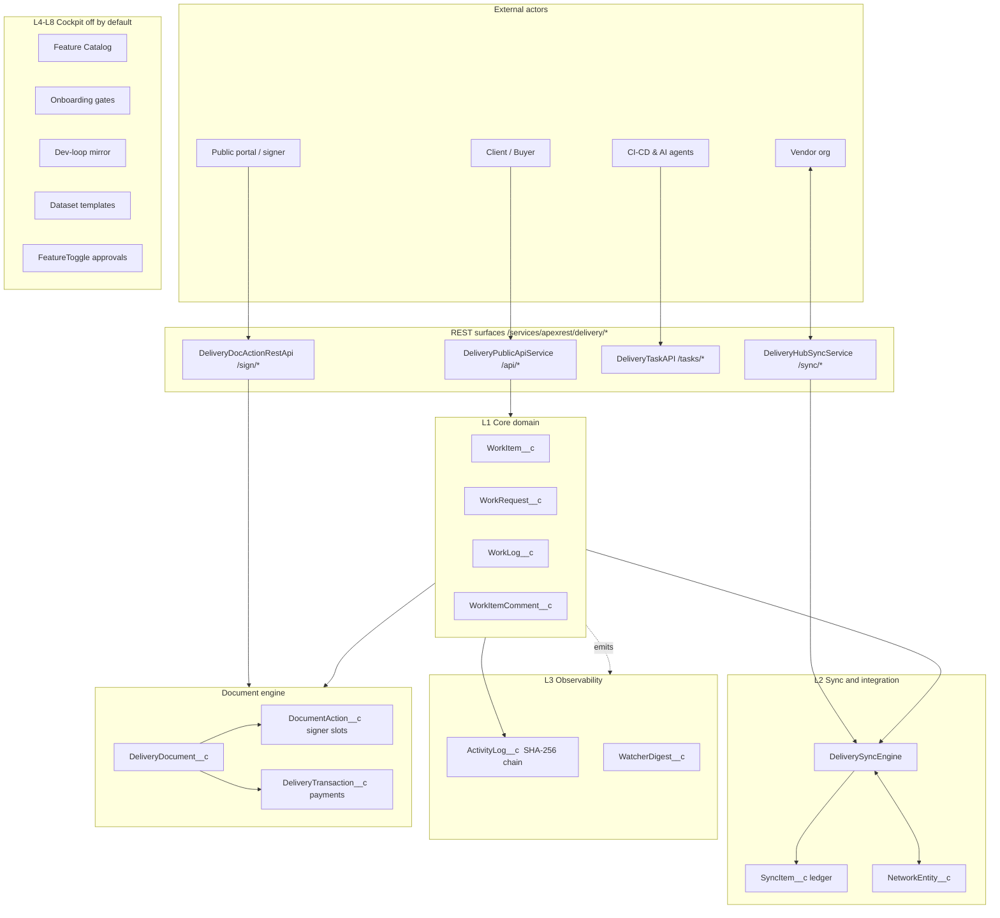
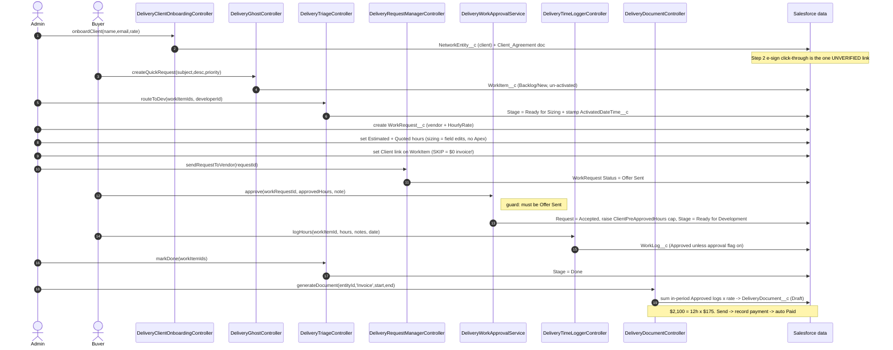
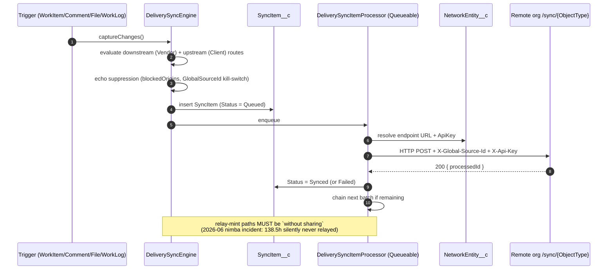
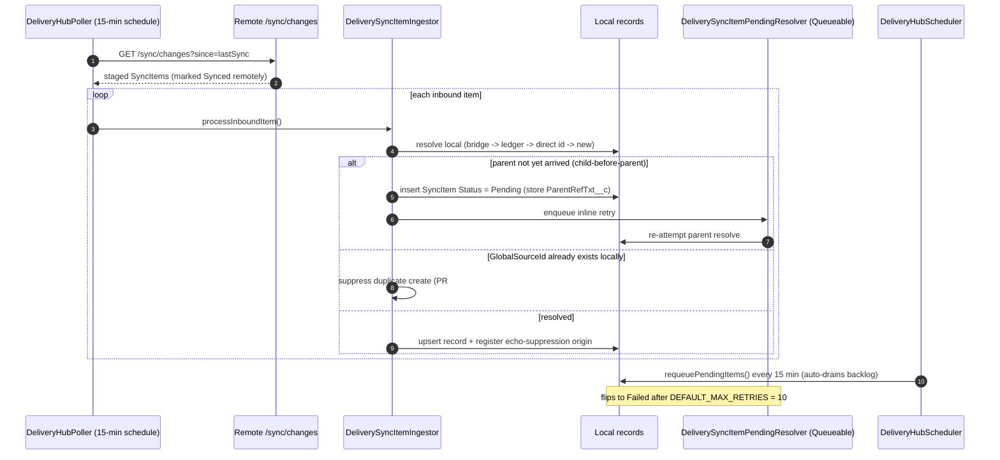
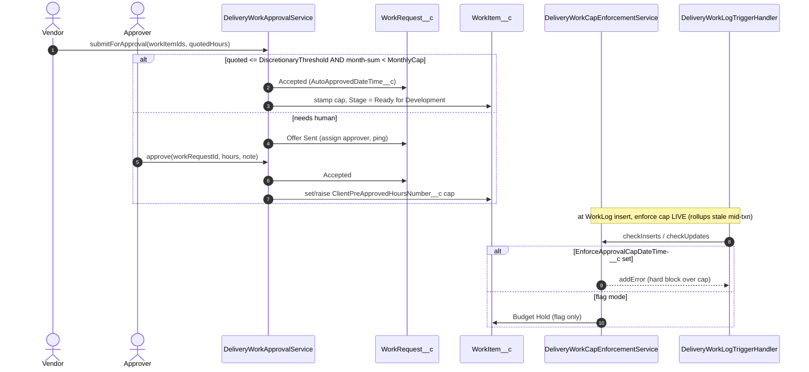
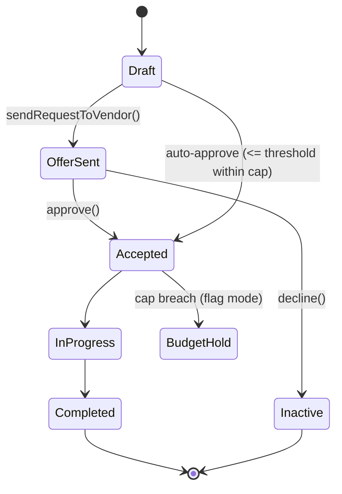
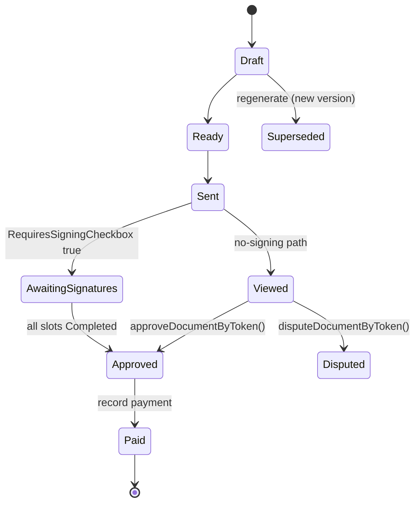

# Delivery Hub — Mental Model (Mermaid)

> Visual companion to `ARCHITECTURE.md`. Every diagram below is drawn from the shipped code
> (controllers, triggers, services) and the confirmed-happy-path runbook, not from the marketing README.
> Paste any block into a Mermaid renderer (VS Code Mermaid extension, GitHub, mermaid.live).

---

## 1. System context — the 8 layers



---

## 2. The money loop — request to paid invoice (THE product)

> This is the one loop the whole product exists to serve. Verified backend-proven on a fresh
> install 2026-07-09, ending in a $2,100 invoice. Method names are the real `@AuraEnabled` controllers.



---

## 3. Sync push flow (outbound, org to org)



---

## 4. Sync pull + the Pending race-handler



---

## 5. Document signing (native e-sign, no DocuSign)

```mermaid
sequenceDiagram
    autonumber
    actor Signer
    participant API as DeliveryDocActionRestApi  POST /sign/{token}
    participant SVC as DeliveryDocActionService
    participant DA as DocumentAction__c (slot)
    participant AL as ActivityLog__c (SHA-256 chain)
    participant DOC as DeliveryDocument__c
    participant CERT as DeliveryDocCertificateService

    Signer->>API: POST /sign/{token} {name,email,consent,signatureData}
    API->>SVC: signActionByToken(token, ctx)
    SVC->>DA: FOR UPDATE lock (blocks double-sign)
    SVC->>DA: apply signature + ip + user-agent + consent
    SVC->>AL: insert Document_Sign row
    SVC->>AL: re-query -> materialize PriorHashTxt__c
    SVC->>DA: stamp parent hash, rotate signer token to null
    Note over DOC: trigger advances Document -> Approved when all slots Completed
    DOC->>CERT: auto-generate Certificate_Of_Completion
    Note over API,AL: KNOWN GAP: external portal hashChainVerified can never return true;<br/>drawn (image) signatures silently dropped on public path
```

---

## 6. Work-approval / spend-control (roadmap Step 2, ~90% built)



---

## 7. WorkRequest lifecycle (state)



## 8. Document status flow (state)



---

## Where to go next

- **Roadmap:** `DELIVERY-HUB-FUTURE.md` (sell first, finish work-approval, build Proof Pack).
- **Bug list:** `flow/fix-register.md` (F9/F6 fixed, T6 pushed, F7 tech-debt, B12 needs a call).
- **State-of-play matrix:** `flow/00-master-execution-tracker.md` (honest believed vs confirmed).
- **Deep reference:** `ARCHITECTURE.md` (846 lines, object/class/trigger detail).
- **Do-it-yourself loop:** `flow/confirmed-happy-path.md`.
