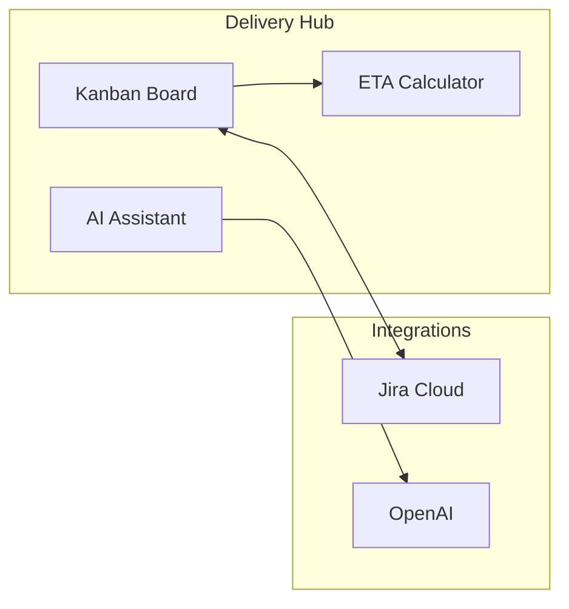

# Welcome to Delivery Hub

Welcome to **Delivery Hub** - your comprehensive project delivery and work item management solution built natively on Salesforce.

## What is Delivery Hub?

Delivery Hub provides a powerful visual Kanban board for managing work items, integrated with the tools your team already uses.

## Key Features

### Visual Kanban Board
Drag-and-drop tickets through your workflow stages. See at a glance where everything stands.

### Role-Based Views
Different team members see different views tailored to their responsibilities:
- **Clients** see a simplified approval-focused board
- **Consultants** see the full project picture
- **Developers** see development-focused stages
- **QA** sees testing-focused stages

### Jira Integration
If your organization uses Jira, Delivery Hub keeps everything in sync automatically. Changes in either system appear in the other.

### AI-Powered Assistance
Use AI to enhance your ticket descriptions and get effort estimates with a single click.

### Automatic ETA Calculations
Know when work will be completed based on team capacity and ticket priorities.

## Getting Started

Ready to begin? Continue to the [Quick Start Guide](/public/content/01.getting-started/02.quick-start.md) to learn the basics.

## Need Help?

- Click on any ticket to see available actions
- Use the persona selector to switch views
- Check the sidebar for navigation to other documentation sections
