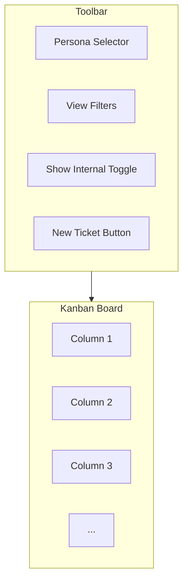
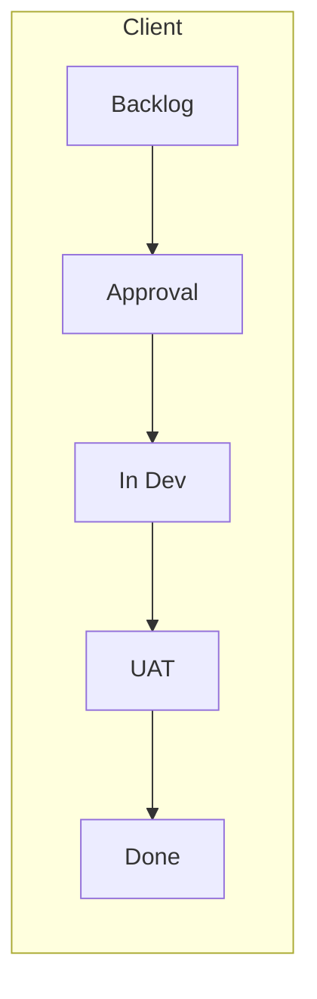
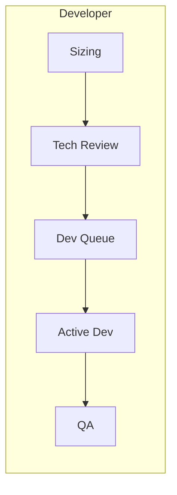

# Quick Start Guide

Get up and running with Delivery Hub in just a few minutes.

## Get Connected

:::flow name="DeliveryHubConnect" height="400px"
:::

## Understanding the Interface

### Navigation Bar

| Control | What it does |
|---------|--------------|
| **Persona** | Switch between Client, Consultant, Developer, and QA views |
| **View Filters** | Focus on All, Pre-Dev, In-Dev, or Deployed stages |
| **Show Internal** | Toggle to see more detailed workflow stages |
| **New Ticket** | Create a new work item |

### Kanban Board

The board displays your tickets organized into columns by workflow stage. Each card shows key information at a glance.

## Your First Actions

### View Your Work

1. Select your **Persona** from the dropdown
2. Tickets relevant to you will appear in the appropriate columns
3. Scroll horizontally to see all stages

### Create a Ticket

1. Click the **New Ticket** button
2. Enter a **Brief Description** (title)
3. Add **Details** if needed
4. Optionally click **Enhance with AI** to improve your description
5. Click **Save**

### Move a Ticket

**Drag and Drop:**
1. Click and hold any ticket card
2. Drag to the target column
3. Release to drop

**Using the Transition Modal:**
1. Click on a ticket card
2. Choose from **Advance** options to move forward
3. Or choose **Backtrack** options to move backward
4. Fill in any required fields
5. Confirm

## Switching Views

### Personas

Different roles see different board configurations:

### Filters

- **All** - See everything
- **Pre-Dev** - Planning and scoping
- **In-Dev** - Active development
- **Deployed** - Testing and production

## Common Tasks

| Task | How to do it |
|------|--------------|
| View ticket details | Click the ticket title |
| Move ticket forward | Drag to next column or click card → Advance |
| Move ticket backward | Click card → Backtrack |
| Create new ticket | Click "New Ticket" button |
| Refresh the board | Click the refresh icon |
| Change your view | Select different Persona |

## Next Steps

- [Using the Kanban Board](/public/content/02.core-concepts/01.kanban-board.md) - Learn all board features
- [Managing Tickets](/public/content/02.core-concepts/02.managing-tickets.md) - Create and edit work items
- [Using AI Features](/public/content/04.ai-features/01.ai-ticket-enhancement.md) - Enhance tickets with AI
