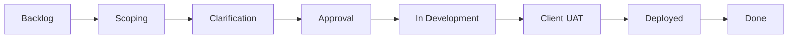
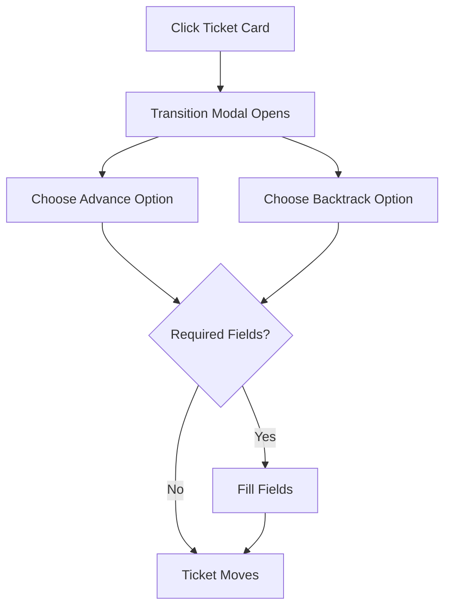

# Using the Kanban Board

The Kanban board is your primary workspace for managing tickets in Delivery Hub.

## Board Overview

The board displays your work items as cards organized into columns representing workflow stages.

```mermaid
flowchart LR
    subgraph Board["Your Kanban Board"]
        direction LR
        B[Backlog] --> S[Scoping] --> D[Development] --> Q[QA] --> U[UAT] --> Done
    end
    
    style B fill:#f3f4f6
    style S fill:#fef3c7
    style D fill:#ff9100
    style Q fill:#22c55e
    style U fill:#2563eb
    style Done fill:#374151
```

## Personas

Different team members see different views. Select your persona from the dropdown to see the board configured for your role.

### Client View

A simplified view focused on approvals and high-level progress.

**What you see:**
- Stages where your input is needed
- Simplified development stages (merged into one)
- Clear approval checkpoints

### Consultant View

Full visibility across all workflow stages.

**What you see:**
- All detailed stages
- Granular development tracking
- Full deployment pipeline

### Developer View

Development and technical review focused.

**What you see:**
- Sizing and estimation stages
- Detailed development columns (Queue, Active, Blocked, Rework)
- QA handoff stages

### QA View

Testing and quality focused.

**What you see:**
- Development handoff
- Detailed testing stages (Scratch Test, QA, Internal UAT)
- Client UAT visibility

## Filtering Your View

### Stage Filters

Use the filter buttons to focus on specific workflow phases:

| Filter | Shows |
|--------|-------|
| **All** | All active tickets |
| **Pre-Dev** | Planning, scoping, and approval stages |
| **In-Dev** | Development and testing stages |
| **Deployed** | UAT and production stages |

### Show Internal Toggle

- **Off:** Shows core stages only (simpler view)
- **On:** Shows all detailed stages (granular tracking)

### Intention Filter

Filter tickets by their purpose:

| Filter | Description |
|--------|-------------|
| **All** | Show everything |
| **Will Do** | Confirmed work that will be done |
| **Sizing Only** | Items for estimation only |

## Moving Tickets

### Drag and Drop

The fastest way to move tickets:

1. **Click and hold** a ticket card
2. **Drag** to the destination column
3. **Release** to drop

The card will move to the new stage immediately.

### Transition Modal

For more control or when required fields need to be filled:

1. **Click** on a ticket card (don't drag)
2. A modal appears with your options
3. Select an **Advance** option to move forward
4. Or select a **Backtrack** option to move backward
5. Complete any required fields
6. Confirm the move

## Understanding Ticket Cards

Each card displays key information:

| Element | Description |
|---------|-------------|
| **Priority Badge** | Color indicates High (red), Medium (yellow), or Low (green) |
| **Title** | Click to open the full ticket record |
| **ETA** | Calculated completion date |
| **Dev Days** | Estimated effort |
| **Tags** | Categorization labels |
| **Dependency Icon** | Click to manage blocking relationships |

### Card Colors

Card borders indicate stage ownership:
- **Blue** - Client action needed
- **Yellow** - Consultant action needed
- **Orange** - Developer action needed
- **Green** - QA action needed

## ETA Calculations

Delivery Hub calculates estimated completion dates based on:

1. **Team size** - Number of developers available
2. **Ticket size** - Estimated developer days
3. **Position** - Order in the queue
4. **Dependencies** - Blocked relationships

### Adjusting Team Size

Change the **# Devs** input in the toolbar to recalculate ETAs with different team capacities.

## Display Modes

### Kanban View (Default)

Full-featured cards showing all details. Best for daily work.

### Compact View

Condensed cards for when you need to see more tickets at once.

### Table View

Traditional tabular layout for data-heavy review.

## Tips for Effective Use

1. **Start your day** by reviewing tickets in your queue
2. **Keep tickets moving** - update status promptly
3. **Use filters** to focus on what matters now
4. **Check dependencies** before starting blocked work
5. **Review ETAs** to manage expectations
