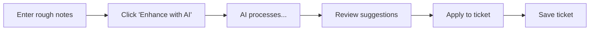
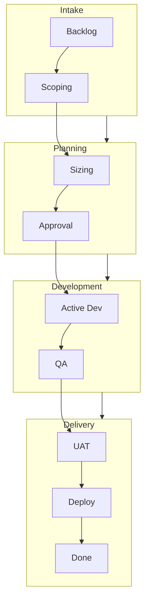

# Managing Tickets

Learn how to create, edit, and organize tickets in Delivery Hub.

## Creating Tickets

### From the Kanban Board

1. Click the **New Ticket** button in the toolbar
2. Fill in the ticket form
3. Click **Save**

### Required Fields

| Field | Description |
|-------|-------------|
| **Brief Description** | A short title for the ticket (max 255 characters) |
| **Stage** | The initial workflow stage (defaults to Backlog) |
| **Priority** | High, Medium, or Low |

### Optional Fields

| Field | Description |
|-------|-------------|
| **Details** | Full description of the work |
| **Developer** | Assigned team member |
| **Developer Days** | Estimated effort |
| **Tags** | Comma-separated categorization labels |
| **Client Intention** | Will Do or Sizing Only |
| **Epic** | Parent epic or project identifier |

## Using AI Enhancement

When creating a ticket, you can use AI to improve your description:



1. Enter a brief title and/or rough description
2. Click **Enhance with AI**
3. Review the suggestions panel
4. Click **Apply Suggestions** to use them
5. Make any final adjustments
6. Save the ticket

The AI will provide:
- A professional, clear title
- A detailed description with requirements
- An estimated effort (if AI estimation is enabled)

## Editing Tickets

### Quick Edit

Click the ticket title to open the full record, then edit fields as needed.

### Stage Changes

Move tickets to different stages using:
- **Drag and drop** on the Kanban board
- **Transition modal** by clicking a card

### Updating Priority

Higher priority tickets should be positioned at the top of columns. Priority affects:
- Visual prominence (badge color)
- ETA calculations
- Attention from team members

## Ticket Lifecycle

Tickets flow through stages based on your organization's workflow:



### Stage Types

| Stage Type | Color | Description |
|------------|-------|-------------|
| **Queue** | Light blue/gray | Waiting for action |
| **Active Work** | Orange/Yellow | Currently being worked |
| **Blocked** | Red | Waiting on something |
| **Complete** | Green/Gray | Finished |

## Estimating Work

### Developer Days

Enter the estimated effort in developer days:

| Size | Typical Work |
|------|--------------|
| **0.5-1** | Small fix, minor change |
| **2-3** | Standard task, single feature |
| **5-7** | Medium feature, multiple components |
| **10+** | Large feature (consider breaking down) |

### Tips for Estimation

1. Include development, testing, and review time
2. Consider integration complexity
3. Add buffer for unknowns
4. Use AI suggestions as a starting point

## Working with Tags

Tags help categorize and filter tickets.

### Adding Tags

Enter comma-separated values in the Tags field:

```
frontend, sprint-23, urgent
```

### Common Tag Patterns

| Pattern | Examples |
|---------|----------|
| Component | `frontend`, `backend`, `api` |
| Sprint | `sprint-23`, `q1-2024` |
| Type | `bug`, `feature`, `tech-debt` |
| Client | `acme-corp`, `project-alpha` |

## Uploading Files

Attach files to tickets for reference:

1. Open the ticket record
2. Find the Files section
3. Upload your files

If Jira integration is enabled, files automatically sync to the linked Jira issue.

## Comments

Add comments to track discussions and decisions:

1. Open the ticket record
2. Use the Comments section
3. Enter your comment and save

Comments sync with Jira if integration is enabled.

## Best Practices

### Writing Good Titles

| Poor | Better |
|------|--------|
| "fix bug" | "Login fails for users with special characters in password" |
| "new feature" | "Add export to Excel on Reports page" |
| "update" | "Update user profile validation rules" |

### Writing Good Descriptions

Include:
- **What** needs to be done
- **Why** it's needed (context)
- **Acceptance criteria** (how we know it's done)
- **Any constraints** or considerations

### Keeping Tickets Current

1. Update status when work begins and ends
2. Add comments for important decisions
3. Adjust estimates if scope changes
4. Close tickets when complete
