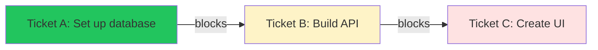
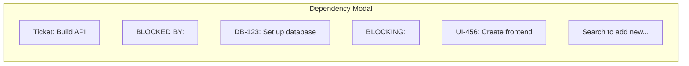
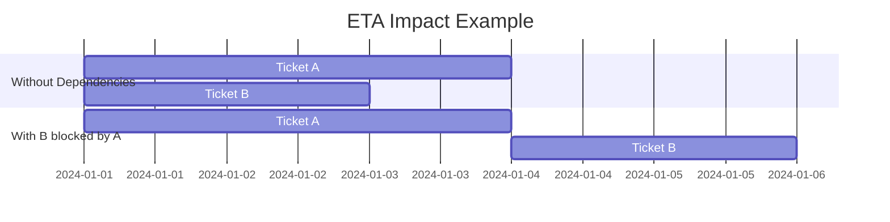
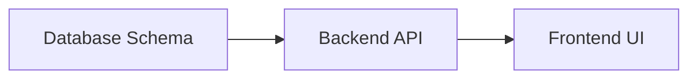
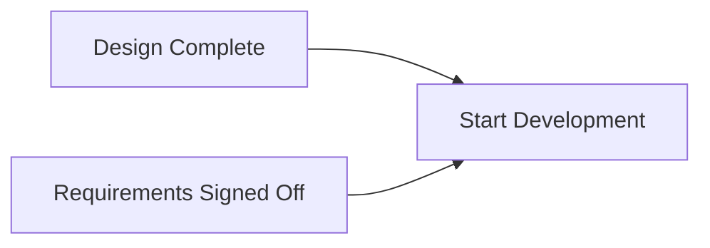
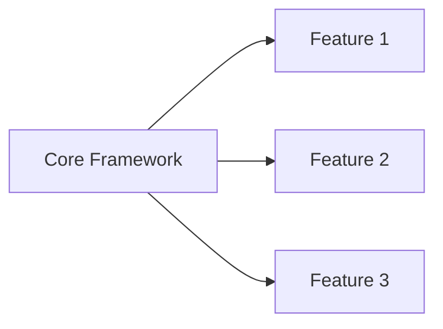

# Working with Dependencies

Dependencies track when one ticket blocks another from progressing.

## Understanding Dependencies

In this example:
- **Ticket A** must be completed first
- **Ticket B** is blocked by A, and blocks C
- **Ticket C** cannot start until both A and B are done

## Why Track Dependencies?

- **Avoid wasted work** - Don't start something that will be blocked
- **Plan effectively** - Know the critical path
- **Accurate ETAs** - Completion dates account for blockers
- **Clear communication** - Everyone sees what's waiting on what

## Viewing Dependencies

### On Ticket Cards

Tickets with dependencies show a visual indicator:

- **Blocked tickets** have a red highlight
- **"Blocked by: XXX"** shows which ticket is blocking
- **Dependency icon** allows management

### Dependency Modal

Click the dependency icon on any card to see:

## Managing Dependencies

### Adding a Dependency

1. Click the **dependency icon** on a ticket card
2. In the modal, find the **search box**
3. Enter at least 3 characters to search
4. Click **Add** next to the blocking ticket

The dependency is created immediately.

### Removing a Dependency

1. Click the **dependency icon** on a ticket card
2. Find the dependency you want to remove
3. Click the **×** button next to it

The dependency is removed immediately.

## Dependency Impact

### On the Kanban Board

- Blocked tickets show a **red highlight**
- Blocking tickets show they are blocking others
- You can see at a glance what's waiting

### On ETAs

Dependencies affect when tickets can be completed:

Without the dependency, both could start immediately. With B blocked by A, B's ETA is pushed out.

## Common Dependency Patterns

### Sequential Work

Each piece depends on the previous.

### Multiple Blockers

Development can't start until both design AND requirements are ready.

### One Blocking Many

Multiple features waiting on a foundational piece.

## Best Practices

### When to Use Dependencies

**Do use** for:
- Technical prerequisites
- Sequential work that can't overlap
- External blockers

**Don't use** for:
- Soft preferences
- Nice-to-have ordering
- Unrelated tickets

### Keeping Dependencies Current

1. **Review regularly** - Check if blockers are still valid
2. **Remove when resolved** - Don't leave stale dependencies
3. **Keep chains short** - Long dependency chains are fragile

### Avoiding Problems

- **No circular dependencies** - A can't block B if B blocks A
- **Don't over-depend** - Only add real blockers
- **Communicate** - Let the blocking ticket owner know they're blocking others

## Troubleshooting

### "Why is my ticket blocked?"

Click the ticket to see what's blocking it, then:
1. Check if the blocker is truly necessary
2. Talk to the owner of the blocking ticket
3. Consider if the dependency can be removed

### "I can't find the ticket I need"

The search requires at least 3 characters. Try:
- Searching by ticket number
- Searching by keywords in the title
- Checking if the ticket is already a dependency

### Stuck Dependencies

If a blocker is stuck:
1. Flag it to leadership
2. Consider if work can proceed differently
3. Update stakeholders on the impact
