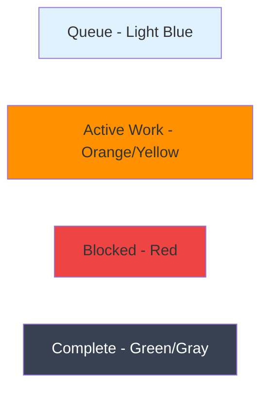

# Workflow Stages

Understanding the stages your tickets move through in Delivery Hub.

## Stage Overview

Tickets flow through stages representing the lifecycle of work:

```mermaid
flowchart LR
    subgraph Intake["1. Intake"]
        A[Backlog]
        B[Scoping]
    end
    
    subgraph Definition["2. Definition"]
        C[Clarification]
        D[Sizing]
        E[Prioritization]
    end
    
    subgraph Approval["3. Approval"]
        F[Tech Review]
        G[Client Approval]
    end
    
    subgraph Development["4. Development"]
        H[Ready for Dev]
        I[In Development]
        J[Blocked/Rework]
    end
    
    subgraph Testing["5. Testing"]
        K[QA]
        L[Internal UAT]
    end
    
    subgraph Delivery["6. Delivery"]
        M[Client UAT]
        N[Deployment]
        O[Done]
    end
    
    Intake --> Definition --> Approval --> Development --> Testing --> Delivery
```

## Stage Details

### Phase 1: Intake

| Stage | Who Owns It | What Happens |
|-------|-------------|--------------|
| **Backlog** | Consultant | New items waiting to be reviewed |
| **Scoping** | Consultant | Active scoping and discovery |

### Phase 2: Definition & Sizing

| Stage | Who Owns It | What Happens |
|-------|-------------|--------------|
| **Clarification Requested** | Client | Questions sent to client |
| **Providing Clarification** | Client | Client providing answers |
| **Ready for Sizing** | Developer | Queue for estimation |
| **Sizing Underway** | Developer | Actively estimating effort |
| **Ready for Prioritization** | Client | Waiting for priority decision |
| **Prioritizing** | Client | Setting priority |

### Phase 3: Approval

| Stage | Who Owns It | What Happens |
|-------|-------------|--------------|
| **Ready for Tech Review** | Consultant | Queue for technical review |
| **Tech Reviewing** | Consultant | Technical feasibility check |
| **Ready for Client Approval** | Client | Waiting for client sign-off |
| **In Client Approval** | Client | Client reviewing and deciding |

### Phase 4: Development

| Stage | Who Owns It | What Happens |
|-------|-------------|--------------|
| **Ready for Development** | Developer | Queue for development |
| **In Development** | Developer | Actively being built |
| **Dev Clarification Requested** | Client | Developer needs answers |
| **Providing Dev Clarification** | Client | Answering dev questions |
| **Back for Development** | Developer | Returned for rework |
| **Dev Blocked** | Developer | Waiting on dependency |

### Phase 5: Testing

| Stage | Who Owns It | What Happens |
|-------|-------------|--------------|
| **Ready for Scratch Test** | QA | Queue for initial testing |
| **Scratch Testing** | QA | Initial testing underway |
| **Ready for QA** | QA | Queue for full QA |
| **QA In Progress** | QA | Full QA testing |
| **Ready for Internal UAT** | Consultant | Queue for internal review |
| **Internal UAT** | Consultant | Internal acceptance testing |

### Phase 6: Client UAT & Delivery

| Stage | Who Owns It | What Happens |
|-------|-------------|--------------|
| **Ready for Client UAT** | Client | Queue for client testing |
| **In Client UAT** | Client | Client testing the work |
| **Ready for UAT Sign-off** | Client | Awaiting client approval |
| **Processing Sign-off** | Client | Sign-off in progress |
| **Ready for Merge** | Consultant | Queue for code merge |
| **Merging** | Consultant | Code being merged |
| **Ready for Deployment** | Consultant | Queue for deployment |
| **Deploying** | Consultant | Active deployment |
| **Deployed to Prod** | System | Live in production |
| **Done** | All | Complete |
| **Cancelled** | All | Work cancelled |

## Stage Colors

Stages use colors to indicate their nature:

| Color | Meaning |
|-------|---------|
| **Light blue/gray** | Waiting in queue |
| **Orange/yellow** | Active work happening |
| **Red** | Blocked or needs attention |
| **Green** | Testing/QA |
| **Gray** | Complete or cancelled |

## Moving Between Stages

### Moving Forward (Advance)

Click a ticket to see available forward moves. Options depend on:
- Current stage
- Your role/permissions
- Required fields being complete

### Moving Backward (Backtrack)

Sometimes work needs to go back a step:
- **Rework needed** - Returns to development
- **More clarification** - Returns to clarification stage
- **Scope change** - Returns to scoping

### Required Fields

Some stage transitions require specific information:

| Moving To | Often Requires |
|-----------|----------------|
| Ready for Development | Developer assigned, Estimate |
| In Client UAT | Acceptance criteria defined |
| Done | All testing complete |

## Tips for Smooth Workflow

1. **Update promptly** - Move tickets as soon as work status changes
2. **Add context** - Leave comments when moving tickets
3. **Check blockers** - Review dependencies before starting work
4. **Communicate** - Let the next owner know work is ready
