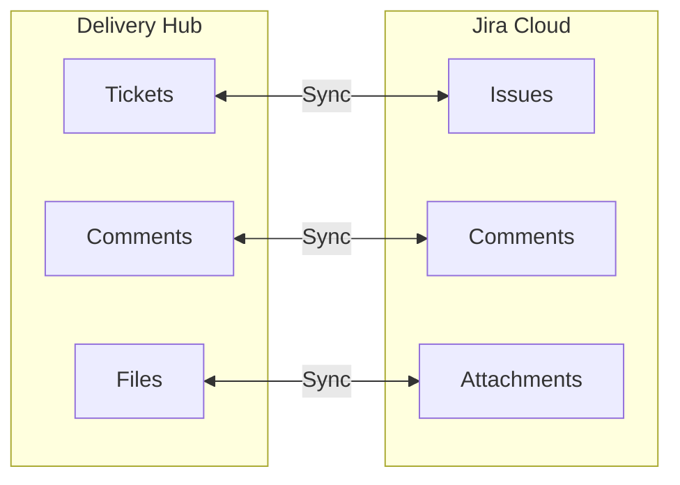
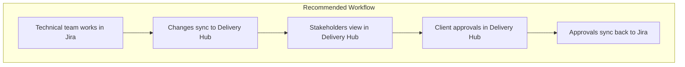

# Jira Integration

Delivery Hub can synchronize with Jira Cloud, keeping your tickets in sync between both systems.

## How It Works

When Jira integration is enabled, changes flow automatically between systems:

## What Syncs

### From Jira to Delivery Hub

When something changes in Jira, Delivery Hub updates automatically:

| Jira Action | Delivery Hub Result |
|-------------|---------------------|
| Issue created | New ticket appears |
| Issue updated | Ticket fields update |
| Comment added | Comment syncs to ticket |
| File attached | File syncs to ticket |
| Status changed | Ticket stage updates |

### From Delivery Hub to Jira

When you make changes in Delivery Hub:

| Delivery Hub Action | Jira Result |
|---------------------|-------------|
| Upload file | Attachment syncs to issue |
| Add comment | Comment syncs to issue |
| Change stage | Issue status may update |

## Working with Synced Tickets

### Identifying Synced Tickets

Tickets synced from Jira show:
- **Jira Key** (e.g., PROJ-123)
- **Last sync time**
- **Sync status**

### Making Changes

You can work with synced tickets just like any other ticket:

1. **Move stages** - Changes sync to Jira
2. **Add comments** - Comments appear in Jira
3. **Upload files** - Files attach to the Jira issue

### Handling Conflicts

If the same ticket is edited in both systems simultaneously:
- The most recent change typically wins
- Review the ticket if something looks off
- Comments and files accumulate (not overwritten)

## Sync Status

Tickets show their sync status:

| Status | Meaning |
|--------|---------|
| **Synced** | Up to date with Jira |
| **Pending** | Changes waiting to sync |
| **Failed** | Sync encountered an error |

If you see a failed status, try:
1. Refreshing the board
2. Checking if the Jira issue still exists
3. Contacting your administrator

## Best Practices

### For Smooth Syncing

1. **Make changes in one place** - Pick either Jira or Delivery Hub as your primary
2. **Wait for sync** - Give changes a moment to propagate
3. **Check sync status** - Verify important changes synced

### When Using Both Systems

## Frequently Asked Questions

### "Why isn't my ticket showing?"

The ticket may not have synced yet. Wait a moment and refresh. If it still doesn't appear:
- Check if the ticket exists in Jira
- Verify the ticket matches sync filters
- Contact your administrator

### "I changed something but it didn't sync"

Some changes may take a moment to sync. If it's been several minutes:
- Refresh the page
- Check the sync status on the ticket
- Contact your administrator if the issue persists

### "Can I create tickets in Delivery Hub that sync to Jira?"

This depends on your organization's configuration. Ask your administrator about the sync direction settings.

### "What happens if Jira is down?"

You can continue working in Delivery Hub. Changes will queue and sync when Jira is available again.

## Need Help?

If you're experiencing sync issues:
1. Note the ticket number and what you expected to happen
2. Check if other tickets are syncing normally
3. Contact your Delivery Hub administrator
