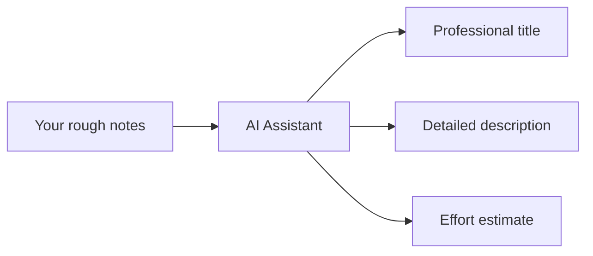

# AI Ticket Enhancement

Use AI to improve your ticket descriptions and get effort estimates automatically.

## What AI Can Do

When creating or editing tickets, AI helps you:

### Transform Rough Notes

**Before AI:**
> "fix login bug"

**After AI:**
> **Title:** Login Authentication Failure for Special Characters
> 
> **Description:** Users are experiencing authentication failures when their passwords contain special characters. This needs investigation and resolution to ensure all valid passwords work correctly. Include testing for various special character combinations.
> 
> **Estimate:** 2 days

## Using AI Enhancement

### Step 1: Enter Your Initial Notes

In the create ticket form, enter at least a title or description:

- A few words is fine
- Rough notes work great
- The more context you provide, the better the AI suggestions

### Step 2: Click "Enhance with AI"

Click the **Enhance with AI** button. You'll see a loading indicator while AI processes your input.

### Step 3: Review Suggestions

A suggestions panel appears with:

- **Enhanced Title** - A clear, professional title
- **Enhanced Description** - Detailed requirements and context
- **Estimated Days** - Suggested effort (if estimation is enabled)

### Step 4: Apply or Dismiss

**To use the suggestions:**
1. Click **Apply Suggestions**
2. Fields are populated with AI content
3. Make any adjustments you want
4. Save the ticket

**To dismiss:**
- Click **Dismiss** or the × button
- Your original content remains
- You can try again with different input

## Tips for Better Results

### Provide Context

The more context you give, the better the suggestions:

| Input Quality | Example | Result Quality |
|---------------|---------|----------------|
| Minimal | "fix bug" | Generic suggestions |
| Basic | "fix login bug" | Better, but still general |
| Good | "fix login bug where password reset emails aren't sending" | Detailed, specific suggestions |

### Include Key Details

Mention relevant information:
- What component or area is affected
- What the expected behavior should be
- Any constraints or considerations
- Who is impacted

### Use Domain Keywords

Include relevant keywords for your type of work:

| Domain | Keywords to include |
|--------|---------------------|
| UI work | "form", "button", "page", "modal", "responsive" |
| API work | "endpoint", "integration", "data", "sync" |
| Bug fixes | "error", "fails", "broken", "incorrect" |
| Features | "add", "create", "enable", "new capability" |

## Understanding AI Estimates

### What Estimates Include

AI estimates consider:
- Complexity of the described work
- Typical effort for similar tasks
- Testing and review time

### Estimate Guidelines

| Estimate | Typical Work |
|----------|--------------|
| 1-2 days | Simple fixes, minor changes |
| 3-5 days | Standard features, moderate complexity |
| 5-10 days | Complex features, multiple components |
| 10+ days | Large features (consider breaking down) |

### Adjusting Estimates

AI estimates are starting points. Adjust based on:
- Your team's familiarity with the area
- Technical debt or complexity
- Dependencies on other work
- Testing requirements

## When AI Isn't Available

If AI enhancement isn't working:

1. **Check if it's enabled** - Your admin may not have configured AI
2. **Try again** - Temporary issues can occur
3. **Write manually** - You can always create tickets without AI

## Frequently Asked Questions

### "Do I have to use AI?"

No, AI enhancement is optional. You can create tickets with your own content anytime.

### "Can AI see my other tickets?"

No, AI only sees the title and description you provide in the current form. It doesn't access your other data.

### "Why are some estimates way off?"

AI estimates based on typical work patterns. Your specific context (technical debt, team expertise, etc.) may require adjustment.

### "Can I use AI to edit existing tickets?"

Currently, AI enhancement is available when creating new tickets. For existing tickets, edit manually.

### "What if I don't like the suggestions?"

Simply dismiss them and keep your original content. You can also apply suggestions and then modify them.
