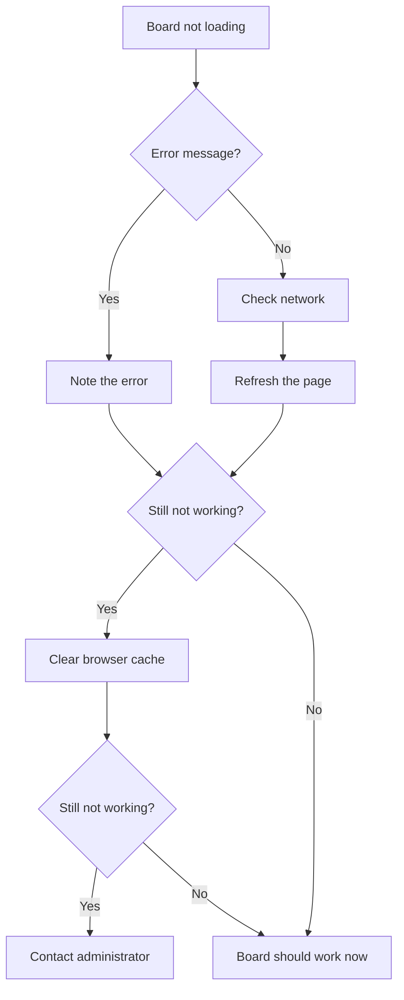

# FAQ & Troubleshooting

Common questions and solutions for Delivery Hub.

## Frequently Asked Questions

### General

**Q: How do I switch between different views?**

Use the **Persona** dropdown in the toolbar to switch between Client, Consultant, Developer, and QA views. Each shows stages relevant to that role.

**Q: Why do some columns appear/disappear?**

Toggle the **Show Internal** checkbox to show or hide detailed stages. When unchecked, you see a simplified view.

**Q: How often does the board refresh?**

The board updates when you make changes. Click the refresh icon to manually reload data.

### Tickets

**Q: How do I create a new ticket?**

Click the **New Ticket** button in the toolbar, fill in the form, and click Save.

**Q: Can I move a ticket to any stage?**

No, tickets can only move to valid next or previous stages. Click a ticket to see available options.

**Q: What do the colors on ticket cards mean?**

- **Red badge** = High priority
- **Yellow badge** = Medium priority  
- **Green badge** = Low priority
- **Red card highlight** = Ticket is blocked

**Q: How do I find a specific ticket?**

Use your browser's find function (Ctrl+F / Cmd+F) to search for text on the board, or use Salesforce's global search.

### Jira Integration

**Q: How do I know if a ticket is synced with Jira?**

Synced tickets show a Jira key (like PROJ-123) and sync status information.

**Q: I made a change but it's not showing in Jira**

Changes may take a moment to sync. Wait 30 seconds and check again. If it still hasn't synced, contact your administrator.

**Q: Can I create tickets in Delivery Hub that go to Jira?**

This depends on your organization's configuration. Ask your administrator about sync direction settings.

### AI Features

**Q: The AI button isn't working**

AI features need to be enabled and configured by your administrator. If you see the button but it's not working, there may be a temporary issue—try again in a few minutes.

**Q: AI suggestions don't match what I need**

AI provides suggestions based on common patterns. You can modify the suggestions after applying them, or dismiss them and write your own content.

**Q: Are AI estimates accurate?**

AI estimates are starting points based on typical work patterns. Always adjust based on your specific context and team capacity.

## Troubleshooting

### Board Not Loading

**Steps to try:**
1. Refresh the page
2. Clear your browser cache
3. Try a different browser
4. Check if Salesforce is working (can you access other pages?)
5. Contact your administrator

### Tickets Not Moving

**"I can't drag this ticket"**
- You may not have permission for that stage
- The ticket may have required fields that need to be filled
- Try clicking the ticket instead and using the transition modal

**"Required fields error"**
- Some stages require specific information
- Fill in the required fields shown in the modal
- Then complete the move

### Changes Not Saving

**"My changes disappeared"**
1. Check if you clicked Save
2. Refresh the page and check if changes are there
3. Look for error messages
4. Try making the change again

**"Getting an error when saving"**
- Note the exact error message
- Check that all required fields are filled
- Try refreshing and attempting again
- Contact your administrator with the error message

### Sync Issues

**"Jira changes aren't showing"**
1. Wait 30-60 seconds for sync
2. Refresh the board
3. Check if other Jira tickets are syncing
4. Contact your administrator

**"My changes aren't going to Jira"**
1. Verify the ticket is linked to Jira
2. Check the sync status on the ticket
3. Wait for sync to complete
4. Contact your administrator if it persists

### Display Issues

**"Cards look wrong or are overlapping"**
1. Refresh the page
2. Try a different display mode (Kanban/Compact/Table)
3. Check browser zoom level (should be 100%)
4. Try a different browser

**"I can't see all the columns"**
1. Scroll horizontally
2. Check the **Show Internal** toggle
3. Try the **Compact** view for more columns
4. Adjust your browser window size

## Getting Help

If you can't resolve an issue:

1. **Document the problem**
   - What were you trying to do?
   - What happened instead?
   - Any error messages?
   - Screenshot if possible

2. **Contact your administrator**
   - Provide the details above
   - Note when the issue started
   - Mention if others are affected

3. **Workarounds**
   - Can you accomplish the task another way?
   - Can you access the ticket record directly?
   - Is there urgency, or can it wait?
